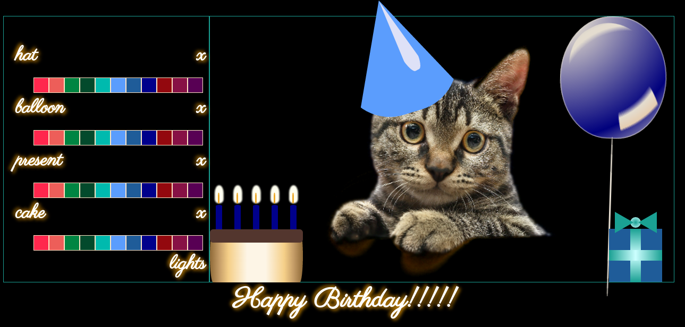

#CatCard

</img>

<a href="https://adrianaalter.github.io/CatCard/">This</a> is a customizable birthday card, written in vanilla JavaScript.  You can choose the colors for the hat, balloon, gift, and candles.  Then, turn out the lights to trigger the CSS3 animations!

</img>
